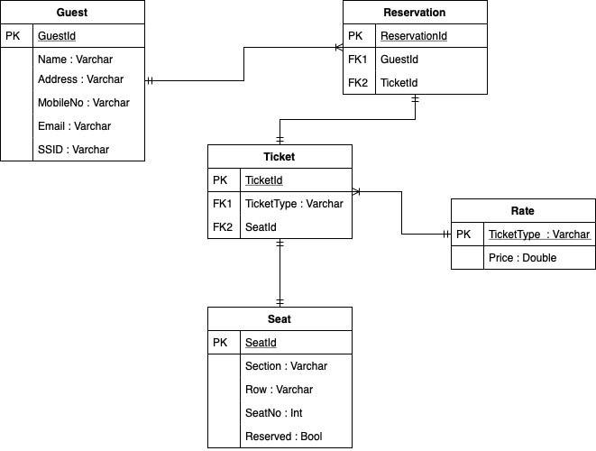

# Soccer League Reservation System

## Assumptions

- In order to reserve a seat, user must have registered an account with us
- Upon reserving/buying the ticket, the seat allocation can happen after the distribution process. Seat selection will be done by phoning in by priority of ticket type; Season ticket owners will be first to select the seat.
- Ticket rate can be updated and the price displayed to users will be retrieved dymanically
- One user is able to make more than one reservations
- One reservation results in one corresponding ticket
- Each ticket determines the section, row, seat in the stadium
- After every matches, the seat-ticket relationship will severed for one-time ticket and be reassigned again after the reservation/purchase

## Database Design

